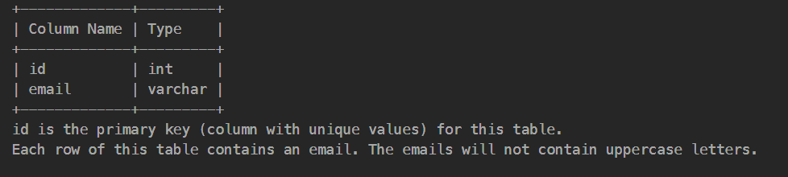
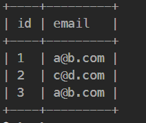
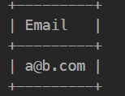

**Table: Person**

id is the primary key (column with unique values) for this table.
Each row of this table contains an email. The emails will not contain uppercase letters.
 

Write a solution to report all the duplicate emails. Note that it's guaranteed that the email field is not NULL.

Return the result table in any order.

The result format is in the following example.

 

**Example 1:**

Input: 
Person table:

Output: 

Explanation: a@b.com is repeated two times.
